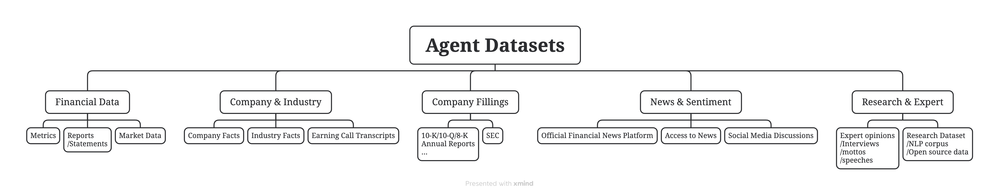

=============================
Overview
=============================

This documentation lists the data sources used to build financial agents.

It covers 15 agents in total: 4 traditional investment strategies and 11 well-known
investors — Warren Buffett, Charlie Munger, Aswath Damodaran, Ben Graham, Bill Ackman, 
Cathie Wood, Michael Burry, Peter Lynch, Phil Fisher, Rakesh Jhunjhunwala, 
and Stanley Druckenmiller.

To help the LLM learn each agent's investment style, we use a data-centric approach. 
This guide explains how to collect and process the training data.
Each agent's data is organized in the following structure:

